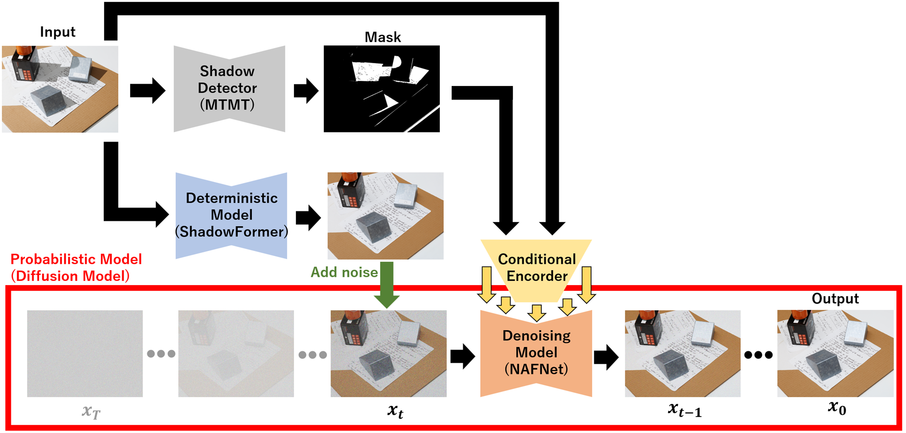

# NTIRE2024 Image Shadow Removal Challenge Team IIM_TTI

This repository is a participation code for the Image Shadow Removal Challenge of the [NTIRE 2024 challenges](https://cvlai.net/ntire/2024/).

## A Hybrid Approach to Shadow Removal: Fusing Deterministic and Probabilistic Models

### Methodology
In this project, we present a novel hybrid approach for shadow removal that combines the strengths of deterministic and probabilistic models to achieve high-quality results with improved computational efficiency and color consistency.

### Deterministic Model
We begin by applying a deterministic method for initial shadow removal. Specifically, we use the method developed by the IIM TTI team, which was a top performer in the NTIRE 2023 Image Shadow Removal Challenge. This method requires a shadow detection step, for which we use SASMA. The deterministic approach provides a solid foundation but tends to produce blurry images, necessitating further refinement.

### Diffusion Model
To enhance the initial results, we incorporate a diffusion model based on recent advancements. Our diffusion model, inspired by the NTIRE 2023 Challenge winner's approach, utilizes NAFNet instead of the traditional U-Net for noise removal. This modification addresses the high computational cost and training difficulty typically associated with diffusion models.

Key improvements in our diffusion model include:

1. Conditioned Diffusion Steps: Instead of starting from random noise, our model begins from the output of the deterministic shadow removal method. This approach reduces computational cost and maintains better global color consistency.

2. Conditioning with Shadow Information: Each noise removal step is conditioned on the input image and its shadow mask, which significantly enhances the Peak Signal-to-Noise Ratio (PSNR) and Learned Perceptual Image Patch Similarity (LPIPS) of the final output.

3. Sigmoid Noise Scheduler: We use a sigmoid noise scheduler instead of a linear one, which has been empirically validated to improve performance.

4. Empirical Step Optimization: The optimal number of diffusion steps was determined through extensive experimentation to balance quality and efficiency.

This hybrid approach leverages the deterministic model's initial accuracy and the diffusion model's refinement capabilities, resulting in high-quality, computationally efficient shadow removal.
## Datasets
datasets were distributed to those who participated in the competition. [Competition page](https://codalab.lisn.upsaclay.fr/competitions/17546)

## Requirement
Create an virtual environment in each of the two folders (using pyenv, etc.).
### Deterministic model

```bash
cd deterministic_model
pip install -r requirements.txt
cd ../
```
### Deterministic model
```bash
cd MTMT
pip install -r requirements.txt
cd ../
```
### Probabilistic model

```bash
cd probabilistic_model
pip install -r requirements.txt
cd ../
```

## Inference

### 1. Arrange the final test data as follows:

```
datasets
└── ntire_24_sh_rem_final_test_inp
    ├── 0000.png
    ├── 0001.png
    ├── ...
    └── 0074.png
```

### 2. Download weights.

* [weight of Deterministic model](https://drive.google.com/file/d/1i_vr90w4J3Uz12QvG0JIgYB7zjDo7aK0/view)
* [weight of MTMT Fine-tuned](https://drive.google.com/file/d/1HXddRaQIGdu4Kn3zlax4Xd2J6Cn0VQGf/view)
* [weight of Probabilistic model](https://drive.google.com/file/d/1PqTUapWVZkxr6p6uZneAISixndIEtpXQ/view)

Place the files in the 'weights' directory as follows:
```
weights
├── finetuned_mtmt_model.pth
├── deterministic_model.pth
└── probabilistic_model.pt
```

### 3. Inference

Run the inference of Deterministic model as follow.
```
cd deterministic_model/
python inference.py 
cd ..
```
Run the inference of MTMT, mask generation model as follow.
```
cd MTMT/
test_MT.py
cd ..
```
Run the Inference of Probabilistic model as follow.
```
cd probabilistic_model/
sh sample_deshadow.sh
```

The results will be output to results/probabilistic_model.

Optionally, Run the following to match the format.
```
rm ../results/probabilistic_model/log.txt ../results/probabilistic_model/progress.csv
python png_compression.py
```


## References
* [ShadowFormer](https://github.com/GuoLanqing/ShadowFormer)
* [MTMT](https://github.com/eraserNut/MTMT)
* [guided-diffusion](https://github.com/openai/guided-diffusion)
* [NTIRE2023_ShadowRemoval_IIM_TTI](https://github.com/Yuki-11/NTIRE2023_ShadowRemoval_IIM_TTI)